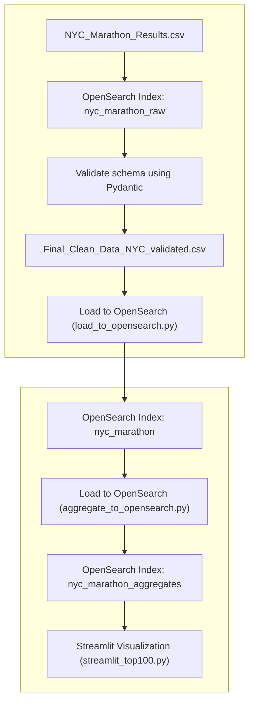

```mermaid
---
config:
  layout: fixed
---
flowchart TB
 subgraph TopRow[" "]
        CSVRaw["NYC_Marathon_Results.csv"]
        OSRaw["OpenSearch Index: nyc_marathon_raw"]
        Validate["Validate schema using Pydantic"]
        CSVV["Final_Clean_Data_NYC_validated.csv"]
        LoadClean["Load to OpenSearch (load_to_opensearch.py)"]
  end
 subgraph BottomRow[" "]
        OS["OpenSearch Index: nyc_marathon"]
        LoadAgg["Load to OpenSearch (aggregate_to_opensearch.py)"]
        OSAgg["OpenSearch Index: nyc_marathon_aggregates"]
        S["Streamlit Visualization (streamlit_top100.py)"]
  end
    CSVRaw --> OSRaw
    OSRaw --> Validate
    Validate --> CSVV
    CSVV --> LoadClean
    LoadClean --> OS
    OS --> LoadAgg
    LoadAgg --> OSAgg
    OSAgg --> S
```
